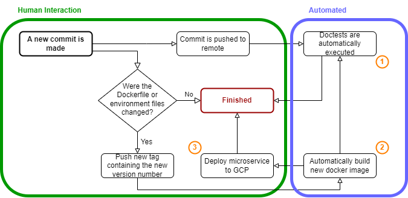

# DALL-E Inpainting image classification

Project Type A: Architectural Design Prototype -> requires a working live demonstration

## Description

Using DALL-E's inpainting feature, images should be adapted (i.e. inserting a wolf into a picture of a forest). Then, a deep learning model (most likely a pretrained image classification model) should be fine-tuned to differentiate between original, unedited images and images that were changed with DALL-E inpainting.

## Repository structure

Source code in /src
Test stuff in /test (apart from doctests directly found in source code)
Save newly trained model in /local_models, which will not be added to git
Copy the best model from /local_models to /models to deploy it in the microservice


## CLC3  Project Proposal

(1) A CI/CD pipeline should be created which handles the automatic execution of Python doctests whenever a new commit is pushed to the remote. The tests are run within a docker container built from a Dockerfile that is part of the repository. 

(2) When developers make changes to this Dockerfile or the poetry environment, a git tag containing a version number can be manually pushed. Upon pushing this tag, the docker container is automatically rebuilt, taking into account all changes to the Dockerfile and the poetry environment. 

(3) Furthermore, when a new tag is pushed, a microservice is automatically deployed on the Google Cloud Platform. This microservice consists of a REST interface that receives an image as a parameter and returns the current model's class prediction for that image.



### CLC3 Final Presentation
The final presentation of the project will include some slides on the implementation of the project and lessons learned along the way.

Additionally, a live demo will feature the following demonstrations:
* a new commit being pushed and the resulting doctest results
* a new tag being pushed and the resulting new docker image
* Google Cloud Platform microservice image classification


# Setup

## Dependency management with poetry
### Quickstart guide
Install Python 3.10 manually from https://www.python.org/downloads/release/python-3100/ and ensure its path is added 
to the PATH environment variable.

In PowerShell: install poetry with the following command:
``` bash
(Invoke-WebRequest -Uri https://install.python-poetry.org -UseBasicParsing).Content | python - --version 1.2.1
```

Add poetry to the PATH environment variable, typically as `%APPDATA%\Python\Scripts`.

Use the correct python version for the environment. You can switch the python version between environments by
calling from the directory containing `pyproject.toml`:
``` bash
poetry env use path/to/Python/Python310/python.exe
```

In PowerShell/CMD: navigate to the project folder `/risc_nlp` which contains `pyproject.toml` and `poetry.lock` 
and run the following command:
``` bash
poetry install
```

### Adding torch to poetry
Add poe the poet (see also https://github.com/nat-n/poethepoet) dependency manually pyproject.toml-file:
```poetry add --dev poethepoet==0.18.0```.\
Run all tasks defined in ```pyproject.toml/[tool.poe.tasks]```, such as the torch cpu dependency installed by the task runner of poe the poet 
```bash
poetry run poe force-torch-cpu
```


### Poetry interpreter in PyCharm
Open the repository in PyCharm, which should automatically recognize poetry and ask for the path to poetry.exe, which 
typically is `%APPDATA%\Python\Scripts\poetry.exe`. 

Poetry integration is available in PyCharm from `2021.3` on. 
Versions before need the Plugin `plugins.jetbrains.com/plugin/14307-poetry`

Create a new Python Interpreter from the existing poetry environment and set it as the project default.
(e.g. in `%APPDATA%\Local\pypoetry\Cache\virtualenvs\your_created_poetry_env\Scripts`)

Note: DO NOT (!) create a new environment from `pyproject.toml` (as PyCharm may suggest)! This may lead to different 
package versions from those already specified in `poetry.lock`!

## Detailed information
### Poetry installation
See https://python-poetry.org/docs/master/#installing-with-the-official-installer

### Using poetry virtual environments
See https://python-poetry.org/docs/basic-usage/

The `poetry install` command will create a virtual environment with all dependencies outlined in `poetry.lock` if 
present, which ensures that all contributors use the exact same versions of all dependencies. If `poetry.lock` does not 
yet exist, it will install all dependencies outlined in `pyproject.toml` and their subdependencies, and create a new 
`poetry.lock` file. 

New dependencies can be added to the poetry environment using `poetry add PACKAGE[@MAJOR.MINOR.PATCH]`.

Dependencies can be removed with `poetry remove PACKAGE`.

These commands will automatically update the `pyproject.toml` and `poetry.lock` files, which should both be committed 
to the repository.

Alternatively, you can manually change the `pyproject.toml` file. After any manual changes you need to run 
`poetry lock --no-update` in order to apply the changes without updating other dependencies to newer versions.
The `poetry.lock` file should not be changed manually.

Poetry may not find a fitting Python version even if it is installed and in the PATH variable, or you may wish to 
change which Python version a specific poetry environment uses. In that case, use the following command with the full 
path to the desired Python installation (e.g. C:\Users\USER\AppData\Local\Programs\Python\Python38\python.exe)
``` bash
poetry env use C:\PATH\TO\python.exe
```
