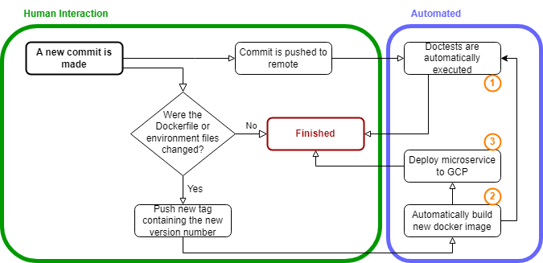

# DALL-E Inpainting image classification

Project Type A: Architectural Design Prototype -> requires a working live demonstration

## Description

Using DALL-E's inpainting feature, images should be adapted (i.e. inserting a wolf into a picture of a forest). Then, a deep learning model (most likely a pretrained image classification model) should be fine-tuned to differentiate between original, unedited images and images that were changed with DALL-E inpainting.

## Project Proposal

(1) A CI/CD pipeline should be created which handles the automatic execution of Python doctests whenever a new commit is pushed to the remote. The tests are run within a docker container built from a Dockerfile that is part of the repository. 

(2) When developers make changes to this Dockerfile or the poetry environment, a git tag containing a version number can be manually pushed, containing a version number. Upon pushing this tag, the docker container is automatically rebuilt, taking into account all changes to the Dockerfile and the poetry environment. 

(3) Furthermore, a microservice is manually deployed on the Google Cloud Platform. This microservice consists of a REST interface that receives an image as a parameter and returns the current model's class prediction for that image.

